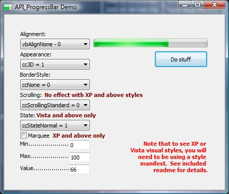



## API\_ProgressBar \(20090506\)

### Description

This API_ProgressBar control emulates most of the properties of Microsoft's ogirinal ProgressBar control. I wrote this control because I have an obsession with not including OCX files in my applications... because I prefer to create single-file programs without dependencies. Included is support for visual styles, if used, and properties specific to XP and Vista, such as Marquee and State. See included readme file for further details.
 
### More Info
 

             |
---                |---
**Submitted On**   |2009-05-04 20:22:36
**By**             |[Michael Redwine](https://github.com/Planet-Source-Code/PSCIndex/blob/master/ByAuthor/michael-redwine.md)
**Level**          |Intermediate
**User Rating**    |5.0 (25 globes from 5 users)
**Compatibility**  |VB 6\.0
**Category**       |[Custom Controls/ Forms/  Menus](https://github.com/Planet-Source-Code/PSCIndex/blob/master/ByCategory/custom-controls-forms-menus__1-4.md)
**World**          |[Visual Basic](https://github.com/Planet-Source-Code/PSCIndex/blob/master/ByWorld/visual-basic.md)
**Archive File**   |[API\_Progre215153562009\.zip](https://github.com/Planet-Source-Code/michael-redwine-api-progressbar-20090506__1-72070/archive/master.zip)

